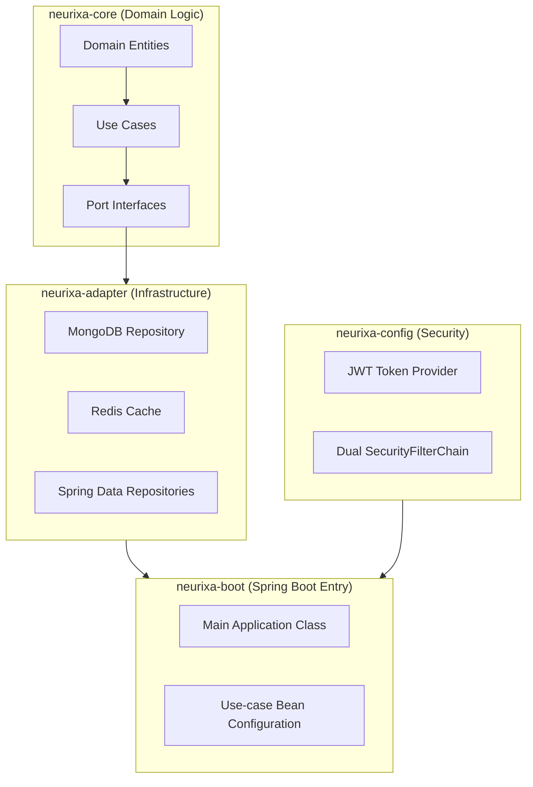

# Neurixa: Your Gateway to Hexagonal Architecture with Spring Boot

Welcome, junior developer! 🎉 **Neurixa** is a hands-on project designed to teach you modern software architecture while building a real-world application. If you're new to Spring Boot, microservices, or clean code principles, this is the perfect starting point. We'll guide you through setting up, running, and understanding a **Hexagonal Architecture** (also called Ports and Adapters) in a multi-module Spring Boot app.

By the end, you'll have a working user management system with authentication, and you'll understand how to structure code that's maintainable, testable, and scalable.

---

## 🚀 What is Neurixa?

Neurixa is a **user management API** built with Spring Boot. It handles user registration, login, role management, and more. But more importantly, it's a learning tool for **Hexagonal Architecture**—a way to organize code so business logic stays pure and separate from databases, web frameworks, or external services.

### Key Features
- User registration and authentication (JWT-based)
- Role-based access control (USER, ADMIN, SUPER_ADMIN)
- Secure endpoints with dual security chains
- MongoDB for data storage, Redis for caching
- RESTful API with OpenAPI documentation

### What You'll Learn
- **Hexagonal Architecture:** Separate core business logic from infrastructure.
- **Spring Boot Basics:** Controllers, beans, configurations.
- **Security:** JWT tokens, role-based permissions.
- **Testing:** Unit and integration tests.
- **Best Practices:** Clean code, SOLID principles, dependency injection.
- **Tools:** Gradle, MongoDB, Redis, Swagger UI.

Don't worry if these terms are new—we'll explain them step by step!

---

## 📋 Prerequisites

Before diving in, make sure you have these installed. We'll keep it simple!

### 1. Java 21
- Download from [Oracle JDK](https://www.oracle.com/java/technologies/javase/jdk21-archive-downloads.html) or use [SDKMAN](https://sdkman.io/).
- Verify: `java -version` (should show Java 21).

### 2. Gradle 8.5+
- Comes with the project (Gradle Wrapper), but install globally if needed: [Gradle Install Guide](https://gradle.org/install/).
- Verify: `./gradlew --version`.

### 3. MongoDB (Database)
- Install locally: [MongoDB Community Server](https://www.mongodb.com/try/download/community).
- Or use Docker: `docker run -d -p 27017:27017 --name mongodb mongo:latest`.
- Runs on `localhost:27017` by default.

### 4. Redis (Cache)
- Install locally: [Redis Download](https://redis.io/download).
- Or use Docker: `docker run -d -p 6379:6379 --name redis redis:latest`.
- Runs on `localhost:6379` by default.

### Optional: IDE
- Use IntelliJ IDEA, VS Code, or Eclipse with Java support.

---

## 🏁 Quick Start: Get Neurixa Running in 5 Minutes

Follow these steps to launch the app locally.

### Step 1: Clone and Navigate
```bash
git clone <your-repo-url>  # Replace with actual repo URL
cd neurixa
```

### Step 2: Start Dependencies
Ensure MongoDB and Redis are running (see Prerequisites).

### Step 3: Build the Project
```bash
./gradlew build
```
This compiles code, runs tests, and packages everything. If it fails, check your Java version or dependencies.

### Step 4: Run the App (Development Mode)
```bash
./gradlew :neurixa-boot:bootRun --args='--spring.profiles.active=dev'
```
- This uses `application-dev.yml` for easy local setup.
- App starts on `http://localhost:8080`.

### Step 5: Verify It's Working
Open in browser: `http://localhost:8080/actuator/health`

You should see: `{"status":"UP"}`

### Step 6: Explore the API
- Swagger UI: `http://localhost:8080/swagger-ui.html` (auto-generated docs).
- Register a user: Use the `/api/auth/register` endpoint in Swagger.

Congrats! 🎊 Your first Hexagonal app is running. Now, let's understand what you built.

---

## 🏗️ Architecture Overview

Neurixa uses **Hexagonal Architecture** to keep code clean. Think of it like a phone: the core (battery/phone logic) doesn't care about the charger type—it just needs power through a standard port.

### The Modules
We split the app into 4 modules for clarity:



- **neurixa-core**: Pure business logic (no Spring or DB code). Defines what users are and how to register them.
- **neurixa-adapter**: Connects core to real tech (e.g., saves users to MongoDB).
- **neurixa-config**: Handles security (JWT, roles).
- **neurixa-boot**: Ties everything together and starts the app.

### Why This Matters
- **Easy Testing:** Test business logic without databases.
- **Flexible:** Swap MongoDB for PostgreSQL by changing only the adapter.
- **Maintainable:** Code is organized and readable.

For deep dives, read [ARCHITECTURE.md](done/ARCHITECTURE.md)—it's a full guide!

---

## 🔧 Building and Running in Detail

### Build Commands
```bash
# Full build with tests
./gradlew build

# Skip tests (faster)
./gradlew build -x test

# Clean and rebuild
./gradlew clean build
```

### Run Commands
- **Dev Mode (Recommended for beginners):**
  ```bash
  ./gradlew :neurixa-boot:bootRun --args='--spring.profiles.active=dev'
  ```
  Uses relaxed settings for local dev.

- **Production Mode:**
  Set a JWT secret (secure random string):
  ```bash
  # macOS/Linux
  JWT_SECRET="$(openssl rand -base64 32)" ./gradlew :neurixa-boot:bootRun

  # Windows PowerShell
  $env:JWT_SECRET = [Convert]::ToBase64String((1..32 | ForEach-Object { Get-Random -Maximum 256 }))
  ./gradlew :neurixa-boot:bootRun

  # Windows CMD
  set JWT_SECRET=your-32-bytes-minimum-secret
  gradlew :neurixa-boot:bootRun
  ```

### Profiles
- `dev`: Local development (default Mongo/Redis).
- `default`: Production-ready (needs env vars).

### Troubleshooting
- **Port in use?** Change ports in `application.yml`.
- **MongoDB connection error?** Ensure MongoDB is running: `brew services start mongodb/brew/mongodb-community` (macOS).
- **Redis error?** Start Redis: `redis-server`.
- **Build fails?** Check Java version and run `./gradlew --version`.

---

## 📖 API Documentation

- **Swagger UI:** Interactive docs at `http://localhost:8080/swagger-ui.html`. Test endpoints directly!
- **Detailed API Guide:** [API-DOCUMENTATION.md](done/API-DOCUMENTATION.md)
- **Curl Examples:** [CURL-ROLE-MANAGEMENT.md](done/CURL-ROLE-MANAGEMENT.md)

### Security Notes
- `/api/auth/**`: Public (register, login).
- `/api/**`: Needs JWT token (from login).
- `/admin/**`: Needs ROLE_ADMIN.

Example: Login to get a token, then use it in headers: `Authorization: Bearer <token>`

---

## 🎯 Next Steps for Learning

1. **Explore the Code:** Open `neurixa-core`—see how `User` entity and `RegisterUserUseCase` work.
2. **Add a Feature:** Try adding a "Change Password" endpoint. Follow the steps in [ARCHITECTURE.md](done/ARCHITECTURE.md).
3. **Write Tests:** Look at `neurixa-core/src/test` for examples.
4. **Contribute:** Fix a bug or improve docs—submit a PR!
5. **Resources:**
   - [Spring Boot Docs](https://spring.io/projects/spring-boot)
   - [Hexagonal Architecture Explained](https://alistair.cockburn.us/hexagonal-architecture/)
   - [JWT Guide](https://jwt.io/introduction/)

---

## 🆘 Support and FAQ

- **Stuck?** Check [ARCHITECTURE.md](done/ARCHITECTURE.md) or [RUN-APPLICATION.md](done/RUN-APPLICATION.md).
- **Common Issues:**
  - Q: "Gradle build fails"? A: Ensure Java 21 and run `./gradlew clean`.
  - Q: "App won't start"? A: Check MongoDB/Redis are running.
  - Q: "403 Forbidden"? A: You need the right role or JWT token.
- **Contact:** Open an issue in the repo or ask in discussions.

Happy coding! 🚀 If you build something cool, share it. Let's make software better together.
