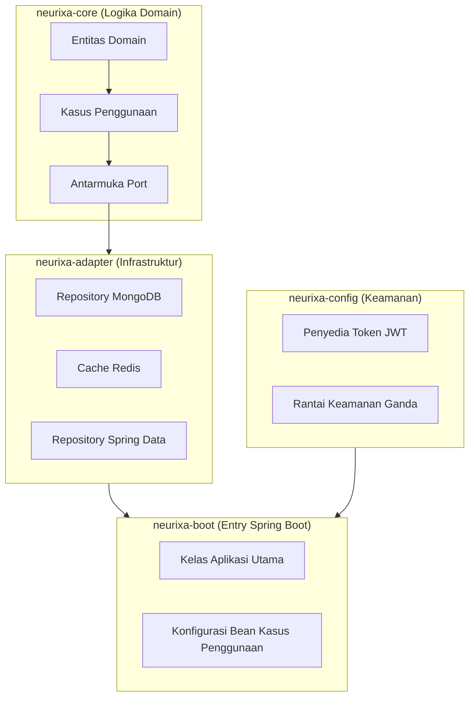

# Neurixa: Pintu Gerbang Anda ke Arsitektur Hexagonal dengan Spring Boot

Selamat datang, pengembang junior! 🎉 **Neurixa** adalah proyek praktis yang dirancang untuk mengajarkan Anda arsitektur perangkat lunak modern sambil membangun aplikasi dunia nyata. Jika Anda baru mengenal Spring Boot, mikroservis, atau prinsip clean code, ini adalah titik awal yang sempurna. Kami akan memandu Anda melalui pengaturan, menjalankan, dan memahami **Arsitektur Hexagonal** (juga disebut Ports and Adapters) dalam aplikasi Spring Boot multi-modul.

Di akhirnya, Anda akan memiliki sistem manajemen pengguna yang berfungsi dengan autentikasi, dan Anda akan memahami cara menyusun kode yang dapat dipelihara, dapat diuji, dan dapat diskalakan.

---

## 🚀 Apa itu Neurixa?

Neurixa adalah **API manajemen pengguna** yang dibangun dengan Spring Boot. Ini menangani pendaftaran pengguna, login, manajemen peran, dan lainnya. Namun yang lebih penting, ini adalah alat pembelajaran untuk **Arsitektur Hexagonal**—cara mengorganisir kode sehingga logika bisnis tetap murni dan terpisah dari database, framework web, atau layanan eksternal.

### Fitur Utama
- Pendaftaran pengguna dan autentikasi (berbasis JWT)
- Kontrol akses berbasis peran (USER, ADMIN, SUPER_ADMIN)
- Endpoint aman dengan rantai keamanan ganda
- MongoDB untuk penyimpanan data, Redis untuk caching
- API RESTful dengan dokumentasi OpenAPI

### Apa yang Akan Anda Pelajari
- **Arsitektur Hexagonal:** Pisahkan logika bisnis inti dari infrastruktur.
- **Dasar-Dasar Spring Boot:** Controller, bean, konfigurasi.
- **Keamanan:** Token JWT, izin berbasis peran.
- **Pengujian:** Pengujian unit dan integrasi.
- **Praktik Terbaik:** Kode bersih, prinsip SOLID, injeksi dependensi.
- **Alat:** Gradle, MongoDB, Redis, Swagger UI.

Jangan khawatir jika istilah-istilah ini baru—kami akan jelaskan langkah demi langkah!

---

## 📋 Prasyarat

Sebelum mulai, pastikan Anda telah menginstal yang berikut. Kami akan menjaganya tetap sederhana!

### 1. Java 21
- Unduh dari [Oracle JDK](https://www.oracle.com/java/technologies/javase/jdk21-archive-downloads.html) atau gunakan [SDKMAN](https://sdkman.io/).
- Verifikasi: `java -version` (harus menunjukkan Java 21).

### 2. Gradle 8.5+
- Sudah disertakan dalam proyek (Gradle Wrapper), tetapi instal secara global jika diperlukan: [Panduan Instal Gradle](https://gradle.org/install/).
- Verifikasi: `./gradlew --version`.

### 3. MongoDB (Database)
- Instal secara lokal: [MongoDB Community Server](https://www.mongodb.com/try/download/community).
- Atau gunakan Docker: `docker run -d -p 27017:27017 --name mongodb mongo:latest`.
- Berjalan di `localhost:27017` secara default.

### 4. Redis (Cache)
- Instal secara lokal: [Unduhan Redis](https://redis.io/download).
- Atau gunakan Docker: `docker run -d -p 6379:6379 --name redis redis:latest`.
- Berjalan di `localhost:6379` secara default.

### Opsional: IDE
- Gunakan IntelliJ IDEA, VS Code, atau Eclipse dengan dukungan Java.

---

## 🏁 Mulai Cepat: Jalankan Neurixa dalam 5 Menit

Ikuti langkah-langkah ini untuk meluncurkan aplikasi secara lokal.

### Langkah 1: Klon dan Navigasi
```bash
git clone <url-repo-anda>  # Ganti dengan URL repo sebenarnya
cd neurixa
```

### Langkah 2: Mulai Dependensi
Pastikan MongoDB dan Redis berjalan (lihat Prasyarat).

### Langkah 3: Bangun Proyek
```bash
./gradlew build
```
Ini mengkompilasi kode, menjalankan pengujian, dan mengemas semuanya. Jika gagal, periksa versi Java atau dependensi.

### Langkah 4: Jalankan Aplikasi (Mode Pengembangan)
```bash
./gradlew :neurixa-boot:bootRun --args='--spring.profiles.active=dev'
```
- Ini menggunakan `application-dev.yml` untuk pengaturan lokal yang mudah.
- Aplikasi dimulai di `http://localhost:8080`.

### Langkah 5: Verifikasi Berfungsi
Buka di browser: `http://localhost:8080/actuator/health`

Anda harus melihat: `{"status":"UP"}`

### Langkah 6: Jelajahi API
- Swagger UI: `http://localhost:8080/swagger-ui.html` (dokumentasi yang dihasilkan otomatis).
- Daftar pengguna: Gunakan endpoint `/api/auth/register` di Swagger.

Selamat! 🎊 Aplikasi Hexagonal pertama Anda berjalan. Sekarang, mari pahami apa yang Anda bangun.

---

## 🏗️ Ikhtisar Arsitektur

Neurixa menggunakan **Arsitektur Hexagonal** untuk menjaga kode tetap bersih. Bayangkan seperti ponsel: inti (baterai/logika ponsel) tidak peduli dengan jenis charger—ia hanya membutuhkan daya melalui port standar.

### Apa itu Arsitektur Hexagonal?
Arsitektur Hexagonal (juga disebut Ports and Adapters) diperkenalkan oleh Alistair Cockburn. Ini adalah pola arsitektur yang menekankan decoupling (pemisahan) antara logika bisnis inti aplikasi dan infrastruktur eksternal seperti database, framework web, atau layanan pihak ketiga.

- **Hexagon (Inti Aplikasi):** Mewakili logika bisnis murni. Ini tidak bergantung pada teknologi spesifik.
- **Ports:** Antarmuka (interface) yang mendefinisikan bagaimana aplikasi berinteraksi dengan dunia luar. Ada dua jenis:
  - **Driving Ports:** Untuk input (misalnya, controller HTTP yang menerima permintaan dari pengguna).
  - **Driven Ports:** Untuk output (misalnya, repository untuk menyimpan data).
- **Adapters:** Implementasi konkret dari ports. Mereka menghubungkan ports ke teknologi nyata, seperti MongoDB adapter untuk penyimpanan data atau REST adapter untuk API web.

Manfaat utama:
- **Mudah Diuji:** Logika bisnis dapat diuji tanpa database atau framework.
- **Fleksibel:** Ganti database dari MongoDB ke PostgreSQL hanya dengan mengubah adapter.
- **Dapat Dipelihara:** Kode terorganisir dan mudah dibaca.

### Apa itu Clean Architecture?
Clean Architecture diperkenalkan oleh Robert C. Martin (Uncle Bob) dan merupakan evolusi dari Arsitektur Hexagonal. Ini menambahkan struktur lapisan yang lebih eksplisit untuk memisahkan tanggung jawab.

Lapisan utama (dari dalam ke luar):
1. **Entities (Entitas):** Objek domain murni yang mewakili konsep bisnis (misalnya, User, Comment). Tidak bergantung pada framework.
2. **Use Cases (Kasus Penggunaan):** Logika aplikasi yang mengatur interaksi antara entitas. Ini adalah "aturan bisnis" yang mendefinisikan apa yang aplikasi lakukan (misalnya, RegisterUserUseCase).
3. **Interface Adapters:** Lapisan yang menghubungkan use cases ke dunia luar. Termasuk controller (untuk web), presenters, dan repositories (implementasi ports).
4. **Frameworks & Drivers:** Lapisan terluar, termasuk framework seperti Spring Boot, database, dan alat eksternal.

Clean Architecture menekankan "Dependency Inversion Principle" (DIP): Lapisan dalam tidak bergantung pada lapisan luar; sebaliknya, lapisan luar bergantung pada abstraksi (ports) dari lapisan dalam.

Hubungan dengan Hexagonal: Clean Architecture mengadopsi konsep ports dan adapters dari Hexagonal, tetapi membuatnya lebih terstruktur dengan lapisan eksplisit. Dalam praktik, keduanya sering digunakan bersama.

### Modul-Modul di Neurixa
Kami membagi aplikasi menjadi beberapa modul Gradle (antara lain **neurixa-core**, **neurixa-domain**, **neurixa-application**, **neurixa-adapter**, **neurixa-config**, **neurixa-boot**) agar sesuai dengan prinsip Clean Architecture dan Hexagonal. Diagram berikut menyoroti alur utama inti ↔ adapter ↔ boot:


```mermaid
graph TD
    subgraph Core["neurixa-core (Logika Domain)"]
        CoreEntities[Entitas Domain]
        CoreUseCases[Kasus Penggunaan]
        CorePorts[Antarmuka Port]
    end

    subgraph Adapter["neurixa-adapter (Infrastruktur)"]
        MongoRepo[Repository MongoDB]
        RedisCache[Cache Redis]
        SpringData[Repository Spring Data]
    end

    subgraph Config["neurixa-config (Keamanan)"]
        JWTProvider[Penyedia Token JWT]
        SecurityChains[Rantai Keamanan Ganda]
    end

    subgraph Boot["neurixa-boot (Entry Spring Boot)"]
        MainApp[Kelas Aplikasi Utama]
        BeanConfig[Konfigurasi Bean Kasus Penggunaan]
    end

    CoreEntities --> CoreUseCases
    CoreUseCases --> CorePorts
    CorePorts --> Adapter
    Adapter --> Boot
    Config --> Boot
```

- **neurixa-core**: Logika bisnis murni (tanpa kode Spring atau DB) untuk bounded context “platform” seperti pengguna dan manajemen file—Entities, Use Cases, dan Ports di Clean Architecture.
- **neurixa-domain**: Model domain, invariant, dan antarmuka repository untuk bounded context fitur (saat ini blog). Tanpa framework; dipakai oleh **neurixa-application**.
- **neurixa-application**: Use case yang mengorkestrasi alur fitur di atas **neurixa-domain** (misalnya blog). Tanpa Spring.
- **neurixa-adapter**: Menghubungkan inti ke teknologi nyata (misalnya, menyimpan pengguna ke MongoDB). Ini adalah adapters yang mengimplementasikan ports, sesuai dengan Interface Adapters.
- **neurixa-config**: Kebijakan keamanan terpusat (JWT, Spring Security, blacklist token)—bukan endpoint HTTP.
- **neurixa-boot**: Mengikat semuanya bersama dan memulai aplikasi. Ini adalah lapisan Frameworks & Drivers.

### Peran neurixa-domain, neurixa-adapter, dan neurixa-config

Tiga modul ini melengkapi **inti** (core + application) dan **titik masuk** (boot): domain menyimpan *apa* yang valid dalam bisnis; adapter menyimpan *bagaimana* data disimpan dan layanan teknis dihubungkan; config menyimpan *bagaimana* permintaan dilindungi dan diotentikasi.

#### neurixa-domain

**Peran:** Menampung **model domain** dan **kontrak keluar** (*driven ports*) untuk bounded context fitur tertentu—tanpa framework.

- Isi tipikal: agregat dan value object (`Article`, `Slug`, …), invariant dan transisi status, event domain bila ada, serta antarmuka seperti `ArticleRepository` / `CommentRepository` (hanya kontrak, bukan implementasi MongoDB).
- **Bukan tempat untuk:** anotasi Spring/JPA, kelas `*Document`, query driver, atau use case panjang (itu di **neurixa-application**).
- **Siapa yang bergantung padanya:** **neurixa-application** mengimpor domain untuk menjalankan alur; **neurixa-adapter** mengimplementasikan port repository ke MongoDB.

Dalam repo ini, blog memakai **neurixa-domain** sebagai “kamus” bisnis artikel, kategori, tag, dan komentar. Bounded context platform (pengguna, file) tetap di **neurixa-core** dengan paketnya sendiri—bukan di modul `neurixa-domain`.

#### neurixa-adapter

**Peran:** **Adapter terdorong** (*driven side*): menghubungkan port dari **neurixa-core** dan **neurixa-domain** ke teknologi konkret.

- Isi tipikal: implementasi repository Spring Data MongoDB, dokumen persistensi (`*Document`), mapper domain ↔ persistensi, penyedia penyimpanan file (misalnya penyimpanan lokal), adapter encoder kata sandi, konfigurasi MongoDB yang spesifik adapter.
- **Bukan tempat untuk:** aturan bisnis baru (tetap di core/application/domain); aturan “siapa boleh akses URL mana” (itu **neurixa-config** + mapping di **neurixa-boot**); controller REST (itu **neurixa-boot**).
- **Dependensi:** Modul ini memang sengaja memuat Spring Boot, driver MongoDB, Redis, dll., karena tugasnya adalah “kabel” ke dunia luar.

Dengan memisahkan adapter, inti tetap bisa diuji dengan *fake* repository; mengganti MongoDB atau strategi file hanya menyentuh modul ini dan wiring di boot.

#### neurixa-config

**Peran:** **Konfigurasi keamanan aplikasi** yang dapat dipakai bersama oleh proses yang dijalankan **neurixa-boot**: pembuatan/validasi JWT, filter otentikasi, blacklist token (misalnya lewat Redis), titik masuk untuk respons 401, serta susunan **Spring Security** (rantai filter, izin per pola URL) sesuai kebijakan proyek.

- **Bukan tempat untuk:** definisi entitas domain; implementasi repository database (itu **neurixa-adapter**); daftar endpoint REST atau DTO JSON (itu **neurixa-boot**).
- **Mengapa modul terpisah:** Supaya kebijakan auth terkonsentrasi dan tidak bercampur dengan kode persistensi atau controller. Boot meng-*import* konfigurasi ini sebagai bagian dari komposisi aplikasi.

Ringkasnya: **domain** = bahasa dan aturan data; **adapter** = teknologi simpan–ambil dan integrasi; **config** = gatekeeper identitas dan otorisasi di sisi framework.

### Kapan kode di neurixa-core, kapan di neurixa-application?

Ini pertanyaan yang sering muncul saat menambah fitur. Jawaban singkatnya: **letakkan di *core* jika itu kemampuan platform yang reusable dan bebas framework; letakkan di *application* jika itu orkestrasi fitur bisnis yang mengikat model di *neurixa-domain*.**

#### Inti keputusan

| | **neurixa-core** | **neurixa-application** |
|---|------------------|-------------------------|
| **Peran** | “Mesin” platform: pengguna, file, dan use case lain yang **tidak** mengasumsikan satu produk bisnis tertentu (blog, toko, dll.). | “Lapisan aplikasi” untuk satu area fitur: mengatur alur kerja di atas **agregat dan port** yang didefinisikan di **neurixa-domain**. |
| **Dependensi** | Hanya JDK (dan alat uji). **Tidak** ada Spring, driver DB, atau library infrastruktur. | Bergantung pada **neurixa-domain** (entitas, invariant, port repository). **Tidak** bergantung pada Spring. |
| **Contoh di repo** | Manajemen file (`UploadFileUseCase`, `FileRepository`), domain pengguna di `com.neurixa.core`. | Blog: `CreateArticleUseCase`, `PublishArticleUseCase` yang memakai `Article`, `ArticleRepository` dari domain blog. |

#### Tanya tiga hal ini

1. **Apakah ini aturan / kemampuan yang masuk akal dipakai ulang oleh fitur lain** (misalnya upload file untuk avatar, lampiran artikel, dokumen admin) **tanpa** mengetahui konteks “blog” atau “artikel”? Kalau **ya** → biasanya **neurixa-core** (plus port di core, implementasi di adapter).
2. **Apakah ini alur yang mengikat satu bounded context produk** (misalnya draf → terbit → komentar) dengan entitas yang hidup di **neurixa-domain**? Kalau **ya** → **neurixa-application**.
3. **Apakah kodenya perlu import Spring, anotasi JPA, atau klien HTTP?** Kalau **ya** → **bukan** core maupun application mentah; letakkan infrastruktur di **neurixa-adapter** / konfigurasi di **neurixa-config** / titik masuk HTTP di **neurixa-boot**.

#### Hubungan dengan neurixa-domain

- **neurixa-domain** menyimpan model domain, invariant, dan *antarmuka* repository untuk suatu area (contoh: blog). **neurixa-application** hanya boleh bergantung pada domain, bukan sebaliknya.
- **neurixa-core** memuat bounded context lain (pengguna, file) yang dipandang sebagai fondasi platform. Fitur blog tidak perlu “masuk” ke core kecuali Anda sengaja mengekstrak ulang konsep yang benar-benar generik.

Jika ragu: mulai dari **domain** (entitas + port), lalu tambahkan use case tipis di **application**. Pindahkan ke **core** hanya ketika Anda yakin abstraksinya stabil dan reusable lintas fitur.

#### Kasus sejenis (agar konsisten ke depan)

| Pertanyaan | Arah yang wajar |
|------------|-----------------|
| **Port / interface repository** untuk MongoDB vs memori? | Definisikan port di **domain** atau **core** (sesuai bounded context); implementasi konkret di **neurixa-adapter**. |
| **Controller REST atau DTO response**? | **neurixa-boot** (bukan core/application). |
| **JWT, SecurityFilterChain, bean Spring**? | **neurixa-config** atau **neurixa-boot**, bukan core/application. |
| **Fitur baru selain blog** (misalnya inventaris) dengan model sendiri? | Modul **neurixa-domain** baru (atau paket domain baru) + use case di **neurixa-application** (atau submodul serupa), adapter di **neurixa-adapter**, wiring di **neurixa-boot**. |
| **Logika yang sama muncul di dua fitur application**? | Pertimbangkan mengekstrak ke **core** *hanya jika* benar-benar generik; jika tidak, pertahankan dekat salah satu bounded context atau perkenalkan modul domain bersama yang jelas batasannya. |

### Contoh Pemisahan Fitur untuk Separation of Concerns
Contoh konkret di repositori ini:

- **File Management (di neurixa-core/files)**: Penyimpanan file (upload, rename, pindah, hapus) adalah kemampuan platform. Entitas seperti `StoredFile`, use case seperti `UploadFileUseCase`, dan port seperti `FileRepository` ada di **core**—tanpa Spring—sehingga fitur lain (blog, profil, dll.) bisa memakainya lewat port yang sama.

- **Blog / artikel (di neurixa-domain + neurixa-application/blog)**: Membuat draf, menerbitkan artikel, mengelola komentar adalah **alur fitur** di atas model `Article`, `Comment`, dll. Model dan kontrak repository ada di **neurixa-domain**; orkestrasi seperti `CreateArticleUseCase`, `PublishArticleUseCase` ada di **neurixa-application**. Lampiran artikel nanti bisa memanggil use case file di **core** tanpa mencampur aturan blog ke modul file.

Pemisahan ini memastikan:
- **Decoupling**: Blog bisa menggunakan file tanpa coupling ketat—misalnya, artikel bisa upload gambar via file management.
- **Reusability**: File management bisa digunakan oleh fitur lain tanpa duplikasi kode.
- **Maintainability**: Perubahan pada blog tidak memengaruhi file, dan sebaliknya.
- **Testability**: Uji file management secara independen dari blog.

Ini adalah contoh praktis bagaimana Clean Architecture mendorong modularitas untuk aplikasi yang scalable.

### Mengapa Ini Penting
- **Mudah Diuji:** Uji logika bisnis tanpa database.
- **Fleksibel:** Tukar MongoDB dengan PostgreSQL hanya dengan mengubah adapter.
- **Dapat Dipelihara:** Kode terorganisir dan mudah dibaca.
- **Contoh Praktis:** Dalam Neurixa, `RegisterUserUseCase` di `neurixa-core` tidak tahu tentang MongoDB—ia hanya menggunakan port `UserRepository`. Adapter di `neurixa-adapter` menyediakan implementasi MongoDB.

Untuk penyelaman mendalam, baca [ARCHITECTURE.md](done/ARCHITECTURE.md)—ini adalah panduan lengkap!

---

## 🔧 Membangun dan Menjalankan Secara Detail

### Perintah Build
```bash
# Build penuh dengan pengujian
./gradlew build

# Lewati pengujian (lebih cepat)
./gradlew build -x test

# Bersihkan dan bangun ulang
./gradlew clean build
```

### Perintah Jalankan
- **Mode Dev (Direkomendasikan untuk pemula):**
  ```bash
  ./gradlew :neurixa-boot:bootRun --args='--spring.profiles.active=dev'
  ```
  Menggunakan pengaturan santai untuk dev lokal.

- **Mode Produksi:**
  Atur rahasia JWT (string acak aman):
  ```bash
  # macOS/Linux
  JWT_SECRET="$(openssl rand -base64 32)" ./gradlew :neurixa-boot:bootRun

  # Windows PowerShell
  $env:JWT_SECRET = [Convert]::ToBase64String((1..32 | ForEach-Object { Get-Random -Maximum 256 }))
  ./gradlew :neurixa-boot:bootRun

  # Windows CMD
  set JWT_SECRET=rahasia-anda-minimal-32-byte
  gradlew :neurixa-boot:bootRun
  ```

### Profil
- `dev`: Pengembangan lokal (Mongo/Redis default).
- `default`: Siap produksi (butuh variabel env).

### Pemecahan Masalah
- **Port digunakan?** Ubah port di `application.yml`.
- **Kesalahan koneksi MongoDB?** Pastikan MongoDB berjalan: `brew services start mongodb/brew/mongodb-community` (macOS).
- **Kesalahan Redis?** Mulai Redis: `redis-server`.
- **Build gagal?** Periksa versi Java dan jalankan `./gradlew --version`.

---

## 📖 Dokumentasi API

- **Swagger UI:** Dokumentasi interaktif di `http://localhost:8080/swagger-ui.html`. Uji endpoint langsung!
- **Panduan API Detail:** [API-DOCUMENTATION.md](done/API-DOCUMENTATION.md)
- **Contoh Curl:** [CURL-ROLE-MANAGEMENT.md](done/CURL-ROLE-MANAGEMENT.md)

### Catatan Keamanan
- `/api/auth/**`: Publik (daftar, login).
- `/api/**`: Butuh token JWT (dari login).
- `/admin/**`: Butuh ROLE_ADMIN.

Contoh: Login untuk mendapatkan token, lalu gunakan di header: `Authorization: Bearer <token>`

---

## 🎯 Langkah Selanjutnya untuk Belajar

1. **Jelajahi Kode:** Buka `neurixa-core`—lihat bagaimana entitas `User` dan `RegisterUserUseCase` bekerja.
2. **Tambah Fitur:** Coba tambah endpoint "Ubah Kata Sandi". Ikuti langkah di [ARCHITECTURE.md](done/ARCHITECTURE.md).
3. **Tulis Pengujian:** Lihat `neurixa-core/src/test` untuk contoh.
4. **Kontribusi:** Perbaiki bug atau tingkatkan docs—kirim PR!
5. **Sumber Daya:**
   - [Dokumentasi Spring Boot](https://spring.io/projects/spring-boot)
   - [Penjelasan Arsitektur Hexagonal](https://alistair.cockburn.us/hexagonal-architecture/)
   - [Panduan JWT](https://jwt.io/introduction/)

---

## 🆘 Dukungan dan FAQ

- **Tersendat?** Periksa [ARCHITECTURE.md](done/ARCHITECTURE.md) atau [RUN-APPLICATION.md](done/RUN-APPLICATION.md).
- **Masalah Umum:**
  - Q: "Build Gradle gagal"? A: Pastikan Java 21 dan jalankan `./gradlew clean`.
  - Q: "Aplikasi tidak mulai"? A: Periksa MongoDB/Redis berjalan.
  - Q: "403 Forbidden"? A: Anda butuh peran atau token JWT yang benar.
- **Kontak:** Buka issue di repo atau tanya di diskusi.

Selamat coding! 🚀 Jika Anda membangun sesuatu yang keren, bagikan. Mari buat perangkat lunak lebih baik bersama.
