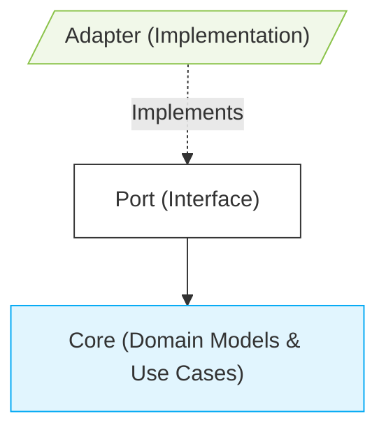
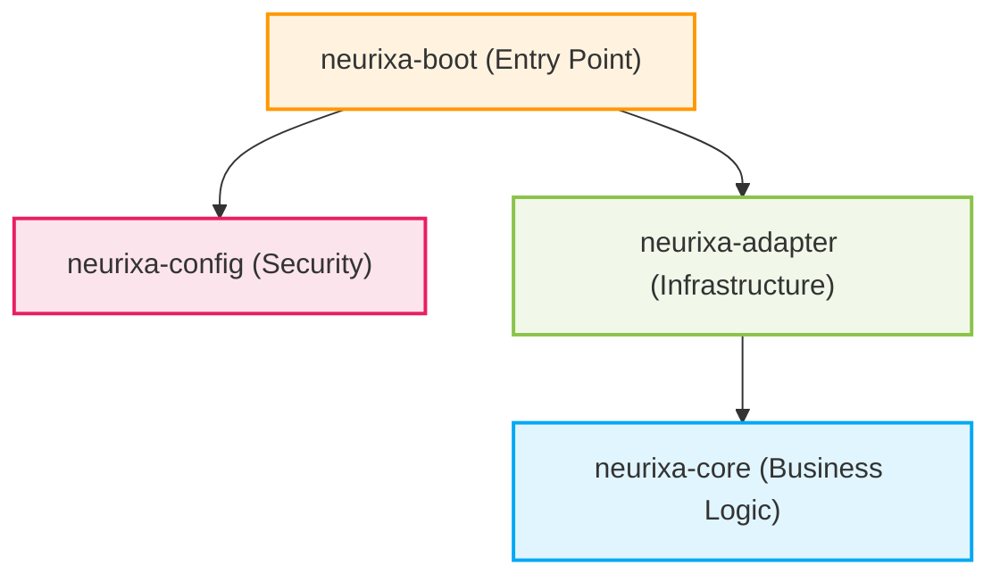
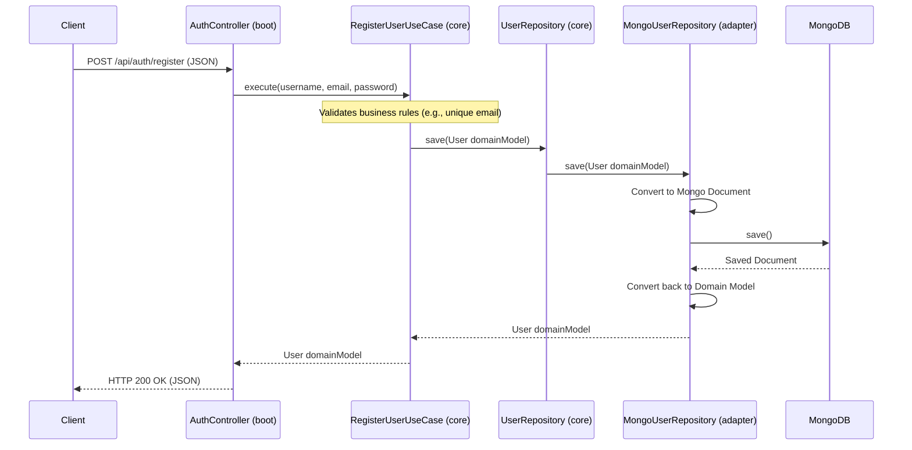

# Neurixa Architecture Guide: Mastering Software Design and Architecture

Welcome to the **Neurixa** project! This comprehensive guide is crafted to empower you—whether you're a beginner dipping your toes into programming or an experienced developer sharpening your skills—to master software design, programming principles, and architectural patterns. We'll explore why good architecture matters, dive into the fundamentals of software design, and dissect Hexagonal Architecture through practical examples from our codebase.

By the end, you'll not only understand how Neurixa works but also gain timeless skills to build maintainable, testable, and scalable software.

---

## 🧭 Table of Contents
1. [Why Software Architecture and Design Matter](#1-why-software-architecture-and-design-matter)
2. [Fundamentals of Software Design](#2-fundamentals-of-software-design)
3. [What is Hexagonal Architecture?](#3-what-is-hexagonal-architecture)
4. [The Neurixa Modules](#4-the-neurixa-modules)
5. [How Data Flows (The Request Lifecycle)](#5-how-data-flows-the-request-lifecycle)
6. [Step-by-Step: Adding a New Feature](#6-step-by-step-adding-a-new-feature)
7. [Testing Strategies in Hexagonal Architecture](#7-testing-strategies-in-hexagonal-architecture)
8. [Local Setup & Commands](#8-local-setup--commands)
9. [FAQ & Common Patterns](#9-faq--common-patterns)

---

## 1. Why Software Architecture and Design Matter

Before we jump into code, let's understand why architecture is crucial. Poorly designed software is like a house built on sand—it might stand for a while, but changes, bugs, and scaling issues will eventually bring it down.

### Key Benefits of Good Architecture
- **Maintainability:** Easy to modify and extend without breaking existing code.
- **Testability:** Isolate and test components independently.
- **Scalability:** Handle growth in users, data, or features.
- **Flexibility:** Swap technologies (e.g., databases) with minimal changes.
- **Team Collaboration:** Clear structure helps multiple developers work efficiently.

### Common Pitfalls in Software Design
- **Tight Coupling:** When classes depend directly on each other, changes cascade.
- **Mixed Concerns:** Business logic mixed with UI or database code.
- **Lack of Abstraction:** Hard-coded implementations instead of interfaces.

In this guide, we'll learn how Hexagonal Architecture addresses these issues.

---

## 2. Fundamentals of Software Design

Software design is about organizing code into logical, reusable parts. Here are core principles we'll apply:

### SOLID Principles
- **S - Single Responsibility:** Each class should have one reason to change.
- **O - Open/Closed:** Open for extension, closed for modification.
- **L - Liskov Substitution:** Subtypes should be substitutable for their base types.
- **I - Interface Segregation:** Clients shouldn't depend on unused interfaces.
- **D - Dependency Inversion:** Depend on abstractions, not concretions.

### Other Key Concepts
- **Abstraction:** Hide complexity with interfaces.
- **Encapsulation:** Bundle data and methods, expose only what's needed.
- **Modularity:** Break systems into independent modules.
- **Dependency Injection:** Pass dependencies rather than creating them inside classes.

We'll see these in action throughout the guide.

---

## 3. What is Hexagonal Architecture?

Hexagonal Architecture, also known as **Ports and Adapters** or inspired by **Clean Architecture**, separates your application's core logic from external concerns like databases, web frameworks, or APIs.

### Traditional Layered Architecture vs. Hexagonal
In traditional **Layered Architecture** (common in Spring Boot):
```
Controller (Web) → Service (Business) → Repository (Data) → Database
```
Problems:
- Business logic depends on frameworks (e.g., Spring annotations).
- Hard to test without starting the full app.
- Switching databases requires changing business code.

**Hexagonal Architecture** inverts this:
- **Core (Business Logic):** Pure domain logic, no external dependencies.
- **Ports:** Interfaces defining how the core interacts with the outside world.
- **Adapters:** Implementations of ports for specific technologies (e.g., MongoDB adapter).

### The Phone Charger Analogy 🔌
Imagine your phone as the **Core**—it knows how to charge and store power but doesn't care about the source.
- **Port:** The USB-C connector (interface/contract).
- **Adapter:** Wall charger, car adapter, or power bank (implementations).

This way, you can plug in any charger without changing the phone.

### The Golden Rule
> 🛡️ **The Core depends on NOTHING.** It defines ports (interfaces) for external interactions. Adapters implement these ports, allowing the core to remain isolated and testable.



Benefits:
- **Testability:** Test core logic with mock adapters.
- **Flexibility:** Change databases or frameworks by swapping adapters.
- **Maintainability:** Business rules are centralized and framework-agnostic.

---

## 4. The Neurixa Modules

Our codebase uses Hexagonal Architecture with four modules, each with clear responsibilities. Dependencies flow inward: outer layers depend on inner ones, but not vice versa.



### 🧠 `neurixa-core` (The Brain - Business Logic)
- **Contents:** Domain models (e.g., `User`), Use Cases (e.g., `RegisterUserUseCase`), Ports (interfaces like `UserRepository`).
- **Rules:** Pure Java—no Spring, no database imports. Only business rules and logic.
- **Benefits:** Fast testing, reusable across frameworks, encapsulates domain knowledge.
- **Example:** A `User` class with validation in its constructor.

### 🔌 `neurixa-adapter` (The Connectors - Infrastructure)
- **Contents:** Implementations of core ports (e.g., `MongoUserRepository` implements `UserRepository`), database mappings, external API clients.
- **Rules:** Translates between core domain objects and external formats (e.g., MongoDB documents). Depends on `neurixa-core`.
- **Benefits:** Isolates technology-specific code; easy to replace (e.g., switch to PostgreSQL).
- **Example:** Converting a `User` domain object to a MongoDB `Document`.

### 🛡️ `neurixa-config` (Security - Shared Infrastructure)
- **Contents:** JWT providers, security filters, authentication logic.
- **Rules:** Provides cross-cutting concerns like security. Independent but used by boot.
- **Benefits:** Centralized security configuration, reusable across modules.

### 🚀 `neurixa-boot` (The Engine - Application Entry)
- **Contents:** REST controllers, Spring configurations, `main()` method, DTOs.
- **Rules:** Wires everything together with dependency injection. The only module with Spring Boot.
- **Benefits:** Entry point for the app; handles HTTP requests and responses.
- **Example:** `AuthController` receives JSON, calls use cases, returns responses.

---

## 5. How Data Flows (The Request Lifecycle)

Understanding data flow helps you see how layers interact. Let's trace a user registration request:



Key Points:
- Data enters via Controllers (DTOs), flows to Use Cases (domain objects), through Ports to Adapters.
- Adapters handle I/O; Core remains pure.
- Errors (e.g., validation failures) bubble back as exceptions.

---

## 6. Step-by-Step: Adding a New Feature

Let's add a "Login" feature to illustrate the process. We'll follow Hexagonal principles.

### Step 1: Define Core Logic (`neurixa-core`)
Focus on business rules—nothing else.

```java
// 1a. Domain Exception
public class InvalidCredentialsException extends RuntimeException {
    public InvalidCredentialsException(String message) {
        super(message);
    }
}

// 1b. Port (Interface)
public interface PasswordEncoder {
    boolean matches(String rawPassword, String encodedPassword);
}

// 1c. Use Case
public class LoginUserUseCase {
    private final UserRepository userRepository;
    private final PasswordEncoder passwordEncoder;
    
    public LoginUserUseCase(UserRepository repo, PasswordEncoder encoder) {
        this.userRepository = repo;
        this.passwordEncoder = encoder;
    }
    
    public User execute(String username, String password) {
        User user = userRepository.findByUsername(username)
            .orElseThrow(() -> new InvalidCredentialsException("Invalid username or password"));
        
        if (!passwordEncoder.matches(password, user.getPasswordHash())) {
            throw new InvalidCredentialsException("Invalid username or password");
        }
        return user;
    }
}
```

### Step 2: Implement Adapters (`neurixa-adapter`)
Provide concrete implementations.

```java
@Component
public class BcryptPasswordEncoder implements PasswordEncoder {
    private final org.springframework.security.crypto.bcrypt.BCryptPasswordEncoder encoder = 
        new org.springframework.security.crypto.bcrypt.BCryptPasswordEncoder();
    
    @Override
    public boolean matches(String rawPassword, String encodedPassword) {
        return encoder.matches(rawPassword, encodedPassword);
    }
}
```

### Step 3: Wire and Expose (`neurixa-boot`)
Use Spring to connect everything and create the API.

```java
// 3a. Configuration Bean
@Configuration
public class UseCaseConfiguration {
    @Bean
    public LoginUserUseCase loginUserUseCase(UserRepository repo, PasswordEncoder encoder) {
        return new LoginUserUseCase(repo, encoder);
    }
}

// 3b. REST Controller
@RestController
@RequestMapping("/api/auth")
public class AuthController {
    private final LoginUserUseCase loginUserUseCase;
    
    public AuthController(LoginUserUseCase useCase) {
        this.loginUserUseCase = useCase;
    }
    
    @PostMapping("/login")
    public ResponseEntity<LoginResponse> login(@RequestBody LoginRequest req) {
        User user = loginUserUseCase.execute(req.getUsername(), req.getPassword());
        return ResponseEntity.ok(new LoginResponse(user));
    }
}
```

This ensures separation: Core is testable without Spring, adapters are swappable.

---

## 7. Testing Strategies in Hexagonal Architecture

Testing is easier with Hexagonal Architecture due to isolation.

### Unit Testing the Core
Test business logic with mocks for ports.
```java
@Test
public void testLoginSuccess() {
    // Arrange
    UserRepository mockRepo = mock(UserRepository.class);
    PasswordEncoder mockEncoder = mock(PasswordEncoder.class);
    when(mockRepo.findByUsername("user")).thenReturn(Optional.of(user));
    when(mockEncoder.matches("pass", "hash")).thenReturn(true);
    
    LoginUserUseCase useCase = new LoginUserUseCase(mockRepo, mockEncoder);
    
    // Act
    User result = useCase.execute("user", "pass");
    
    // Assert
    assertEquals(user, result);
}
```

### Integration Testing Adapters
Test with real databases using test containers.

### End-to-End Testing
Test full flows via controllers.

Benefits: Core tests run in milliseconds; adapters can be tested separately.

---

## 8. Local Setup & Commands

### Prerequisites
- Java 21+
- MongoDB (local or Docker on port 27017)
- Redis (local or Docker on port 6379)

### Building & Running
```bash
# Build and test all modules
./gradlew build

# Run the app in dev mode
./gradlew :neurixa-boot:bootRun --args='--spring.profiles.active=dev'
```

### Testing Tips
Run core tests quickly:
```bash
./gradlew :neurixa-core:test
```

---

## 9. FAQ & Common Patterns

### Q: Why Hexagonal over traditional MVC?
A: Hexagonal decouples business logic from frameworks, making it more testable and flexible.

### Q: Where does validation go?
A: 
- **Business Validation:** In domain models (e.g., age > 18).
- **Input Validation:** In DTOs with annotations (e.g., `@Email`).

### Q: How about DTOs?
A: In `neurixa-boot`. Controllers map DTOs to domain objects and back.

### Q: Transactions?
A: On adapters, not use cases.

### Q: How to handle cross-cutting concerns like logging?
A: Use aspects in adapters or config, but keep core pure.

### Q: SOLID in Hexagonal?
A: Ports are interfaces (DIP), use cases have single responsibility, etc.

### Q: Common mistakes?
A: Putting Spring annotations in core or business logic in adapters.

---

🎉 **You're equipped to build robust software!** Remember the Golden Rule and apply these principles to your projects. Happy coding!
