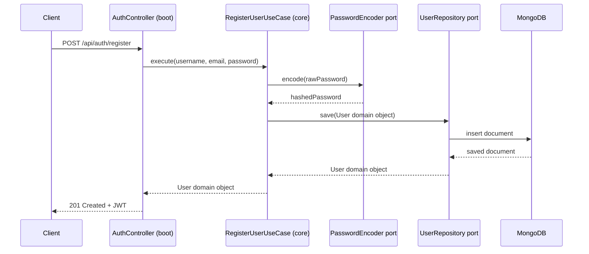

# Neurixa Architecture Guide

## Table of Contents
1. [Why Architecture Matters](#1-why-architecture-matters)
2. [Hexagonal-lite Architecture](#2-hexagonal-lite-architecture)
3. [Module Structure](#3-module-structure)
4. [Request Lifecycle](#4-request-lifecycle)
5. [Adding a New Feature](#5-adding-a-new-feature)
6. [Testing Strategy](#6-testing-strategy)
7. [Common Questions](#7-common-questions)
8. [Transactional Boundaries](#8-transactional-boundaries)

---

## 1. Why Architecture Matters

Good architecture gives you:
- **Maintainability** — change one thing without breaking others
- **Testability** — test business logic without spinning up a database
- **Flexibility** — swap MongoDB for PostgreSQL by touching one file
- **Team clarity** — everyone knows where code belongs

Common pitfalls this architecture avoids:
- Business logic scattered across controllers and repositories
- Framework annotations (`@Autowired`, `@Document`) leaking into domain logic
- Tests that require a running Spring context just to verify a calculation

---

## 2. Hexagonal-lite Architecture

### The Core Idea

The **core domain** knows nothing about the outside world. It only defines *what* it wants via interfaces called **ports**. Everything else — databases, web frameworks, password encoders — is an **adapter** that plugs into those ports.

```
┌─────────────────────────────────────────┐
│              Outside World              │
│  (MongoDB, Redis, HTTP, BCrypt, JWT)    │
│                                         │
│   ┌─────────────────────────────────┐   │
│   │           Adapters              │   │
│   │  (implement ports, translate)   │   │
│   │                                 │   │
│   │   ┌───────────────────────┐     │   │
│   │   │    Core Domain        │     │   │
│   │   │  (pure Java, zero     │     │   │
│   │   │   dependencies)       │     │   │
│   │   │  - Entities           │     │   │
│   │   │  - Use Cases          │     │   │
│   │   │  - Ports (interfaces) │     │   │
│   │   └───────────────────────┘     │   │
│   └─────────────────────────────────┘   │
└─────────────────────────────────────────┘
```

### The Golden Rule
> **The Core depends on NOTHING.** It defines ports (interfaces) for external interactions. Adapters implement those ports.

### Phone Charger Analogy 🔌
- **Phone** = Core domain (knows how to charge, doesn't care about power source)
- **USB-C port** = Port interface (the contract)
- **Wall charger / car adapter** = Adapter implementations

You can swap the charger without modifying the phone.

---

## 3. Module Structure

```
neurixa/
├── neurixa-core/     # Pure domain logic — ZERO external dependencies
├── neurixa-adapter/  # Infrastructure implementations (MongoDB, Redis, BCrypt)
├── neurixa-config/   # Security & cross-cutting config (JWT, Spring Security)
└── neurixa-boot/     # Spring Boot entry point — controllers, DTOs, wiring
```

### Dependency Flow

```
neurixa-boot
  ├── neurixa-adapter  (Spring, MongoDB, Redis)
  │     └── neurixa-core  (PURE JAVA — no frameworks)
  └── neurixa-config   (Spring Security, JWT)
```

Outer layers depend on inner ones. The core never depends on anything outside itself.

### Module Responsibilities

#### 🧠 `neurixa-core` — The Brain
- Domain entities (`User`, `StoredFile`, `Folder`)
- Use cases (`RegisterUserUseCase`, `LoginUserUseCase`, `UploadFileUseCase`)
- Port interfaces (`UserRepository`, `PasswordEncoder`, `StorageProvider`)
- Domain exceptions (`UserAlreadyExistsException`, `InvalidCredentialsException`)
- **Rule:** Pure Java only. No Spring, no Mongo, no Lombok.

#### 🔌 `neurixa-adapter` — The Connectors
- MongoDB repository implementations (`MongoUserRepository`)
- Document mapping classes (`UserDocument`)
- Storage implementations (`LocalStorageProvider`)
- Password encoder adapter (`BcryptPasswordEncoderAdapter`)
- **Rule:** Translates between domain objects and external formats.

#### 🛡️ `neurixa-config` — Security
- `JwtTokenProvider` — token creation and validation
- `JwtAuthenticationFilter` — per-request token processing
- `JwtAuthenticationEntryPoint` — 401 responses
- `SecurityConfig` — dual filter chain (admin + api)
- **Rule:** Centralized, reusable security concerns.

#### 🚀 `neurixa-boot` — The Entry Point
- REST controllers (`AuthController`, `FileController`, `FolderController`)
- DTOs (request/response objects)
- `UseCaseConfiguration` — wires use cases as Spring beans
- `NeurixaApplication` — `main()` method
- **Rule:** Wires everything together. No business logic here.

---

## 4. Request Lifecycle

### Example: User Registration

```
Client
  │  POST /api/auth/register {"username":"john","email":"...","password":"..."}
  ▼
AuthController (neurixa-boot)
  │  Receives RegisterRequest DTO, triggers @Valid
  ▼
RegisterUserUseCase (neurixa-core)
  │  Checks uniqueness, encodes password via PasswordEncoder port
  ▼
BcryptPasswordEncoderAdapter (neurixa-adapter)
  │  Hashes password using BCrypt
  ▼
MongoUserRepository (neurixa-adapter)
  │  Saves UserDocument to MongoDB
  ▼
AuthController
  │  Receives User domain object, generates JWT, converts to UserResponse DTO
  ▼
Client
     201 Created {"token":"...","user":{...}}
```


```mermaid
sequenceDiagram
    participant Client
    participant Controller as AuthController (boot)
    participant UseCase as RegisterUserUseCase (core)
    participant Encoder as PasswordEncoder port
    participant Repo as UserRepository port
    participant DB as MongoDB

    Client->>Controller: POST /api/auth/register
    Controller->>UseCase: execute(username, email, password)
    UseCase->>Encoder: encode(rawPassword)
    Encoder-->>UseCase: hashedPassword
    UseCase->>Repo: save(User domain object)
    Repo->>DB: insert document
    DB-->>Repo: saved document
    Repo-->>UseCase: User domain object
    UseCase-->>Controller: User domain object
    Controller-->>Client: 201 Created + JWT
```

---

## 5. Adding a New Feature

Follow these steps in order to maintain clean boundaries.

### Step 1 — Core: Define business logic (`neurixa-core`)

```java
// 1a. Domain exception (if needed)
public class SomeBusinessException extends DomainException {
    public SomeBusinessException(String message) { super(message); }
}

// 1b. Port (if external I/O is needed)
public interface NotificationService {
    void send(String userId, String message);
}

// 1c. Use case — pure business logic, no Spring
public class SomeUseCase {
    private final UserRepository userRepository;
    private final NotificationService notificationService;

    public SomeUseCase(UserRepository repo, NotificationService notifications) {
        this.userRepository = Objects.requireNonNull(repo);
        this.notificationService = Objects.requireNonNull(notifications);
    }

    public void execute(String userId) {
        User user = userRepository.findById(userId)
            .orElseThrow(() -> new SomeBusinessException("User not found"));
        // business logic
        notificationService.send(userId, "Done");
    }
}
```

### Step 2 — Adapter: Implement external concerns (`neurixa-adapter`)

```java
@Component
public class EmailNotificationService implements NotificationService {
    @Override
    public void send(String userId, String message) {
        // call email API here
    }
}
```

### Step 3 — Boot: Wire and expose (`neurixa-boot`)

```java
// 3a. Register use case as a Spring bean
@Configuration
public class UseCaseConfiguration {
    @Bean
    public SomeUseCase someUseCase(UserRepository repo, NotificationService notifications) {
        return new SomeUseCase(repo, notifications);
    }
}

// 3b. REST controller
@RestController
@RequestMapping("/api/some")
public class SomeController {
    private final SomeUseCase someUseCase;

    public SomeController(SomeUseCase someUseCase) {
        this.someUseCase = someUseCase;
    }

    @PostMapping("/{id}/action")
    public ResponseEntity<MessageResponse> doAction(@PathVariable String id) {
        someUseCase.execute(id);
        return ResponseEntity.ok(new MessageResponse("Action completed"));
    }
}
```

---

## 6. Testing Strategy

### Unit Tests (fastest — milliseconds)
Test core use cases with mocked ports. No Spring context needed.

```java
@Test
void successfulLogin() {
    UserRepository mockRepo = mock(UserRepository.class);
    PasswordEncoder mockEncoder = mock(PasswordEncoder.class);

    when(mockRepo.findByUsername("john")).thenReturn(Optional.of(existingUser));
    when(mockEncoder.matches("rawPass", "hashedPass")).thenReturn(true);

    LoginUserUseCase useCase = new LoginUserUseCase(mockRepo, mockEncoder);
    User result = useCase.execute("john", "rawPass");

    assertEquals("john", result.getUsername());
}
```

### Integration Tests (adapter layer)
Test with real databases using Testcontainers.

### End-to-End Tests (controller layer)
Test full HTTP request/response cycle via `MockMvc` or `TestRestTemplate`.

### Where Each Test Lives

| Test Type | Module | Dependencies |
|-----------|--------|--------------|
| Unit | `neurixa-core` | JUnit, AssertJ, Mockito only |
| Integration | `neurixa-adapter` | Testcontainers + MongoDB/Redis |
| E2E | `neurixa-boot` | `@SpringBootTest` |

---

## 7. Common Questions

**Q: Why Hexagonal instead of layered MVC?**
A: Layered MVC lets business logic bleed into controllers and repositories over time. Hexagonal enforces a hard boundary — the core is always testable without starting the full app.

**Q: Where does validation go?**
A: Two places. Input validation (format checks) goes in DTOs with `@NotBlank`, `@Email` etc. Business validation (age > 18, username uniqueness) goes in the domain model constructor or use case.

**Q: Where do transactions go?**
A: On adapters, not use cases. Use cases orchestrate; adapters handle I/O concerns.

**Q: How do I handle cross-cutting concerns like logging?**
A: Use Spring AOP in the adapter or config layer. Never put logging infrastructure in the core.

**Q: What common mistakes should I avoid?**
A: Don't put Spring annotations (`@Autowired`, `@Component`) inside `neurixa-core`. Don't put business logic inside controllers or adapters.

---

## 8. Transactional Boundaries

### Which Use Cases Need Transactions

Only use cases that perform **more than one write operation** need transaction protection.

| Use Case | Writes | Wrapped In |
|----------|--------|------------|
| `UploadFileUseCase` | `fileRepository.save()` + `fileVersionRepository.save()` | `@Transactional` on `FileController.upload()` |
| `LoginUserUseCase` | `userRepository.save()` × 2 (failed attempt + reset counter) | `@Transactional` on `AuthController.login()` |
| All other use cases | 1 write | No transaction needed |

### Why @Transactional Is on the Controller, Not the Core

The core module has zero Spring dependencies by design. Adding `@Transactional` there would violate the hexagonal-lite rule. Instead, the annotation lives on the controller method — the outermost layer that owns the operation boundary.

```java
// FileController.java
@Transactional  // ← wraps the entire upload operation
@PostMapping(path = "/files/upload", ...)
public ResponseEntity<FileResponse> upload(...) {
    // UploadFileUseCase calls fileRepository.save() + fileVersionRepository.save()
    // If fileVersionRepository.save() fails, fileRepository.save() is rolled back
}
```

### MongoDB Replica Set Requirement

MongoDB multi-document transactions (across multiple collections) **require a replica set or sharded cluster**. A standalone `mongod` does not support them.

**What happens without a replica set:**
- `@Transactional` annotations are silently ignored
- Writes still happen, but without atomicity
- If `fileVersionRepository.save()` fails after `fileRepository.save()` succeeds, you get an orphaned file record

**Dev setup with replica set (Docker):**

```bash
# Start MongoDB as a single-node replica set
docker run -d -p 27017:27017 --name neurixa-mongo \
  mongo:latest --replSet rs0 --bind_ip_all

# Initialise the replica set (run once)
docker exec neurixa-mongo mongosh --eval "rs.initiate()"

# Verify
docker exec neurixa-mongo mongosh --eval "rs.status()"
```

**application-dev.yml** — update URI to include `replicaSet` param if needed:

```yaml
spring:
  data:
    mongodb:
      uri: mongodb://localhost:27017/neurixa?replicaSet=rs0
```

**Production:** Use MongoDB Atlas (replica set by default) or a self-hosted 3-node replica set.

### MongoTransactionManager

`MongoConfig` registers a `MongoTransactionManager` bean which Spring uses to back `@Transactional`:

```java
@Bean
public MongoTransactionManager transactionManager(MongoDatabaseFactory dbFactory) {
    return new MongoTransactionManager(dbFactory);
}
```

Without this bean, `@Transactional` would have no effect even on a replica set.
